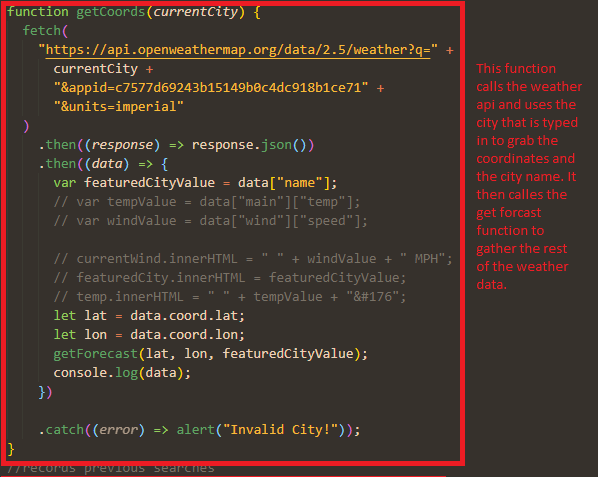

# Weather Dashboard

https://kernbryson.github.io/HW6WeatherDashboard/

## Description

For this project I created a weather dashboard that displays the current weather in your city along with the five day forecast. My motivation behind this project was to give users a way of checking the weather while also giving them useful information like the current UV index and humidity. Throughout the course of creating this project, I was able to get a better grasp on how to call Api's and how to manipulate them to give me the information I want.

## Table of Contents

- [creation](#creation)
- [Usage](#usage)
- [Credits](#credits)

## creation

In order to create this website I first started out by making a basic html page with bootstrap. After I had the website looking like the mock up I began working on the javascript. In order to pull up the weather I fetched two api's; one that gathered the name of the city and the coordinates and another that took the coordinates and gave me back the weather data. I simply then put the data I received in the lists items that corresponded with the correct data. In order to save the search results I created a function that would dynamically create a new button under the search button that saved the previous searches data and when clicked on, would show that city's weather forecast.

## Usage

In order to use this website you simply put in a city in the search bar and click search. The website will then display the current weather including the temperature, wind, humidity, and UV index. Under the current weather the user will see a five day forecast with images that show what the weather will be. At any time the user can click on their previous searches and look at the weather for that city.

## Credits

- Web Dev Simplified - https://www.youtube.com/watch?v=cuEtnrL9-H0&t=260s
- MDN - https://developer.mozilla.org/en-US/
- Open Weather - https://openweathermap.org/
- w3schools- https://www.w3schools.com/

## License

MIT License

Copyright (c) [2022] [Bryson Kern]

Permission is hereby granted, free of charge, to any person obtaining a copy
of this software and associated documentation files (the "Software"), to deal
in the Software without restriction, including without limitation the rights
to use, copy, modify, merge, publish, distribute, sublicense, and/or sell
copies of the Software, and to permit persons to whom the Software is
furnished to do so, subject to the following conditions:

The above copyright notice and this permission notice shall be included in all
copies or substantial portions of the Software.

THE SOFTWARE IS PROVIDED "AS IS", WITHOUT WARRANTY OF ANY KIND, EXPRESS OR
IMPLIED, INCLUDING BUT NOT LIMITED TO THE WARRANTIES OF MERCHANTABILITY,
FITNESS FOR A PARTICULAR PURPOSE AND NONINFRINGEMENT. IN NO EVENT SHALL THE
AUTHORS OR COPYRIGHT HOLDERS BE LIABLE FOR ANY CLAIM, DAMAGES OR OTHER
LIABILITY, WHETHER IN AN ACTION OF CONTRACT, TORT OR OTHERWISE, ARISING FROM,
OUT OF OR IN CONNECTION WITH THE SOFTWARE OR THE USE OR OTHER DEALINGS IN THE
SOFTWARE.
